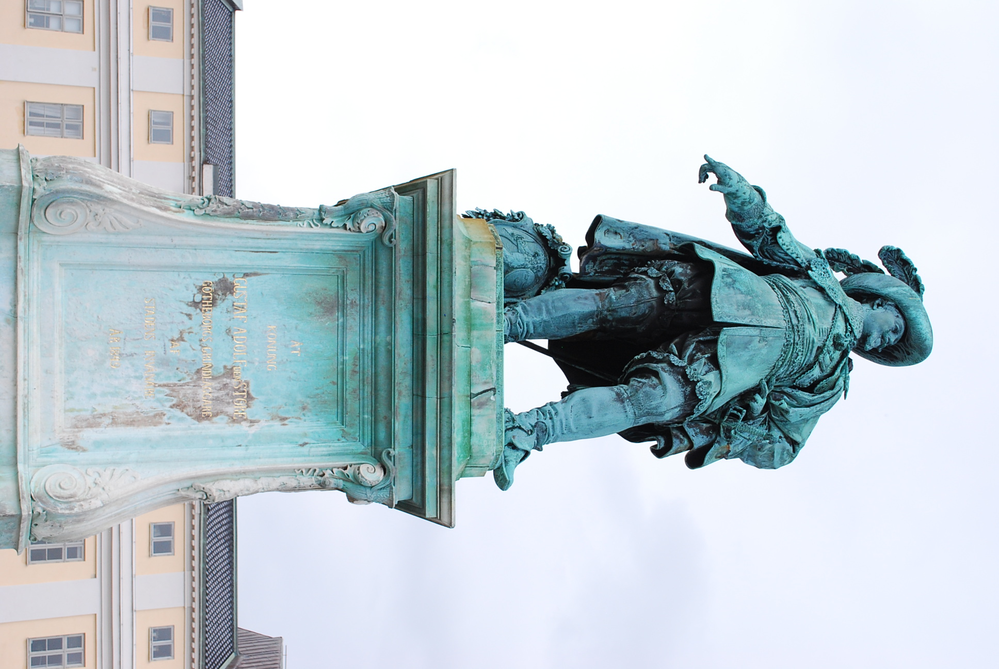
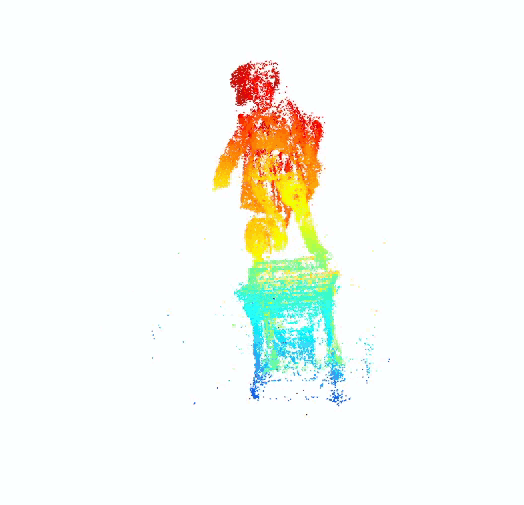

# Sequential-Structure-from-Motion

## Examples from dataset

    

## Demo

The reconstructed 3D points and estimated cameras (position and orientation).

  

The reconstructed 3D points visualized in Open3D.

  

